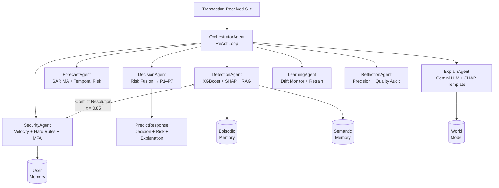

<div align="center">

<h1>
  
</h1>

<h3>Production-Grade Multi-Agent Agentic Architecture for Real-Time Financial Fraud Detection</h3>

<p>
  <a href="#"></a>
  <a href="#"></a>
  <a href="#"></a>
  <a href="#"></a>
  <a href="#"></a>
  <a href="#"></a>
  <a href="#"></a>
</p>

<p>
  
  
  
  
  
</p>

<p>
  <a href="#"></a>
  <a href="LICENSE"></a>
  <a href="#"></a>
</p>

<br/>

> **Eight specialized AI agents. One unified goal: detect fraud before it happens.**  
> Real-time · Explainable · Self-Healing · Multilingual · Production-Deployed

<br/>

[📖 Documentation](#-system-architecture) · [🚀 Quick Start](#-installation--setup) · [📊 Results](#-performance--evaluation) · [🔬 Research](#-research--publication)

</div>

---

## 🎯 The Problem

Modern financial fraud detection faces a **tripartite impossibility**:

| Constraint | Requirement | Why It's Hard |
|---|---|---|
| **Accuracy** | Detect 0.1–0.3% fraud prevalence | Extreme class imbalance |
| **Latency** | Sub-200ms authorization decision | Real-time streaming pressure |
| **Explainability** | GDPR Art. 22 + PCI DSS compliance | Regulatory accountability |

No single model satisfies all three simultaneously. **Monolithic pipelines collapse** under adversarial concept drift — fraud actors adapt faster than static models retrain.

FraudGuard AI resolves this through **coordinated multi-agent reasoning**: eight specialized agents, each optimized for a distinct concern, orchestrated by a unified goal-directed framework.

---

## ⚡ Key Achievements

```
F1 Score         0.952    ████████████████████ (+6.3% over SOTA baseline)
AUC-ROC          0.994    ████████████████████ (+2.0% over SOTA baseline)
Throughput       223 TPS  ████████████████░░░░ Real-time streaming
Avg Latency       52 ms   ████░░░░░░░░░░░░░░░░ Well within 200ms budget
Uptime           100%     ████████████████████ Under all failure modes
Drift Detection  112 txn  ████████████████░░░░ Early warning in ~112 transactions
```

---

## 🏗️ System Architecture

### Five-Layer Design

```
┌─────────────────────────────────────────────────────────────────┐
│  LAYER 1 · DATA INGESTION                                        │
│  Kafka Consumer → Pydantic Validator → build_features()          │
├─────────────────────────────────────────────────────────────────┤
│  LAYER 2 · DETECTION ENGINE                                      │
│  XGBoost Ensemble → SHAP TreeExplainer → SARIMA Forecaster       │
├─────────────────────────────────────────────────────────────────┤
│  LAYER 3 · AGENTIC ORCHESTRATION  ← CORE INNOVATION             │
│  OrchestratorAgent (ReAct) → 8 Specialized Agents               │
│  Tool Registry → Conflict Resolver → Goal Arbitrator             │
├─────────────────────────────────────────────────────────────────┤
│  LAYER 4 · MEMORY & KNOWLEDGE                                    │
│  Episodic Memory → Semantic Memory → User Memory → RAG Index     │
├─────────────────────────────────────────────────────────────────┤
│  LAYER 5 · SERVING & OBSERVABILITY                               │
│  FastAPI REST → WebSocket → Next.js Dashboard → Audit Logger     │
└─────────────────────────────────────────────────────────────────┘
```

### Agent Interaction Flow



### Seven-Path Decision Routing

```
Transaction S_t
      │
      ├─ Hard rule violation? ──────────────────────► P7: BLOCK    (5ms,  1.0%)
      │
      ├─ Velocity exceeded? ───────────────────────► P6: BLOCK    (8ms,  2.4%)
      │
      ├─ P_model > 0.85, clean? ───────────────────► P1: ALLOW    (12ms, 63.4%)
      │
      ├─ 0.50 ≤ P_model ≤ 0.85? ───────────────────► P2: ALLOW/REVIEW (47ms, 19.8%)
      │
      ├─ SARIMA anomaly active? ───────────────────► P3: REVIEW   (63ms, 8.1%)
      │
      ├─ LLM override raised? ─────────────────────► P4: Override (312ms, 4.2%)
      │
      └─ MFA required? ────────────────────────────► P5: MFA      (524ms, 1.1%)
```

---

## 🤖 The Eight Agents

| Agent | Responsibility | Key Tools | Fallback |
|---|---|---|---|
| **OrchestratorAgent** | ReAct loop · Goal arbitration · Conflict resolution | All agents · Tool registry | Sequential conservative fallback |
| **DetectionAgent** | XGBoost inference · SHAP scoring · RAG retrieval | xgboost_predict · shap_explain · rag_lookup | Median imputation + threshold rule |
| **ForecastAgent** | SARIMA temporal anomaly · Deterioration scoring | sarima_forecast · hourly_profile | Rolling mean baseline |
| **SecurityAgent** | Velocity heuristics · MFA lifecycle · Hard rules | velocity_check · hard_rule · mfa_issue | Static velocity threshold |
| **ExplainAgent** | LLM narrative · Multilingual output | gemini_generate · shap_template | SHAP deterministic template |
| **DecisionAgent** | Multi-criteria risk fusion · Path routing | risk_fuse · path_router | Conservative BLOCK on conflict |
| **LearningAgent** | Drift detection · Auto-retraining | drift_monitor · retrain_job | Manual retrain notification |
| **ReflectionAgent** | Self-evaluation · Precision estimation | episodic_precision · quality_audit | Cached prior estimate |

---

## ✨ Features

### 🧠 Agentic Intelligence
- **ReAct Orchestration** — Reasoning and Acting loop with explicit goal stack
- **Conservative Conflict Resolution** — Safety-first protocol when agents disagree (τ = 0.85)
- **Dynamic Goal Weighting** — Runtime-adjustable precision/recall operating modes via `/agent/goals`
- **World Model** — Real-time attacker campaign detection and intent classification

### 🔍 Explainable AI
- **SHAP Attribution** — Per-feature signed attribution for every decision
- **Multilingual LLM Narratives** — Arabic, English, Egyptian dialect via Google Gemini
- **GDPR Article 22 Compliant** — Conversational explanation endpoint `/chat`
- **Regulatory Audit Trail** — Rotating structured log with full decision provenance

### 🧩 Three-Tier Memory
- **Episodic Memory** (E=500) — Rolling prediction history with precision self-estimation
- **Semantic Memory** (S=1,000) — SHAP pattern embeddings for fraud signature retrieval
- **User Memory** — Per-cardholder behavioral profiling for personalized anomaly detection

### 🛡️ Fault Tolerance
- **Self-Healing Infrastructure** — Automated sub-cycle fallback across 4 subsystems
- **Exponential Decay Recovery** — Hysteresis prevents oscillatory re-activation
- **100% Inference Continuity** — Validated under simultaneous 4-subsystem failure injection
- **Graceful Degradation** — System serves reduced-mode inference, never complete outage

### 📊 Adaptive Learning
- **Dual-Signal Drift Detection** — Gap decline + rolling rate elevation trigger
- **Autonomous Retraining** — Model swap without service interruption
- **Temporal Validation** — Validated at 5%, 10%, 15% distributional shift levels

### 🔐 Security
- **CSPRNG-based OTP** — `secrets.token_hex()` + `secrets.randbelow()` (NIST SP 800-63B Level 2)
- **SMTP_SSL Delivery** — Gmail relay with HTML-formatted OTP emails
- **Rate-Limited MFA** — 3 attempts max, 10-minute lockout, 5-minute OTP window
- **PCI DSS Requirement 10** — Tamper-evident rotating audit log

---

## 📦 Repository Structure

```
fraudguard-ai/
│
├── 📁 backend/
│   ├── main.py                    # FastAPI application + API endpoints
│   ├── agent_layer.py             # 8-agent orchestration system (core)
│   ├── email_mfa.py               # MFA service + email delivery
│   └── requirements.txt           # Python dependencies
│
├── 📁 streaming/
│   ├── producer.py                # Kafka producer (real CSV data)
│   └── consumer.py                # Kafka consumer (standalone evaluation)
│
├── 📁 frontend/
│   ├── app/
│   │   ├── predict/page.tsx       # Single transaction prediction UI
│   │   ├── batch/page.tsx         # Batch CSV upload + clustering
│   │   ├── stream/page.tsx        # Live Kafka stream monitor
│   │   ├── chat/page.tsx          # Multilingual AI assistant
│   │   └── reports/page.tsx       # Analytics & confidence distribution
│   └── lib/
│       ├── api.ts                 # Centralized typed API client (40+ endpoints)
│       └── types.ts               # TypeScript interface definitions
│
├── 📁 models/
│   ├── model_latest.pkl           # Active XGBoost model artifact
│   ├── threshold.pkl              # Calibrated decision threshold
│   ├── fcm_scaler.pkl             # Fuzzy C-Means preprocessing
│   └── fcm_pca.pkl                # PCA for cluster visualization
│
├── 📁 research/
│   └── springer_chapter.pdf       # Research manuscript (Springer SCI)
│
├── 📁 docker/
│   └── Dockerfile.backend         # Multi-stage production container
│
├── docker-compose.yml             # Full stack orchestration
├── .env.example                   # Environment variable template
├── README.md                      # This file
└── LICENSE                        # MIT License
```

---

## 🛠️ Tech Stack

### Backend & AI
| Component | Technology | Purpose |
|---|---|---|
| API Framework | FastAPI 0.115 + Uvicorn | ASGI REST + WebSocket serving |
| ML Classifier | XGBoost 2.0.3 | Primary fraud detection model |
| Explainability | SHAP 0.45.0 | Per-decision feature attribution |
| Forecasting | SARIMA (custom) | Temporal anomaly detection |
| Clustering | scikit-fuzzy 0.4.2 | Fuzzy C-Means risk stratification |
| LLM | Google Gemini (google-genai 0.7.0) | Multilingual explanation generation |
| Schema | Pydantic 2.7.4 | Request/response validation |

### Streaming & Infrastructure
| Component | Technology | Purpose |
|---|---|---|
| Message Broker | Apache Kafka 3.x | Real-time transaction streaming |
| Kafka Client | confluent-kafka 2.4.0 | Consumer/producer implementation |
| Containerization | Docker 24.x | Service isolation + deployment |
| Orchestration | Kubernetes (HPA) | Auto-scaling (2–8 pods) |

### Frontend & Observability
| Component | Technology | Purpose |
|---|---|---|
| Dashboard | Next.js 14 + TypeScript | Real-time observability UI |
| Visualization | Recharts | Live charts + confidence distribution |
| Animation | Framer Motion | Smooth UI transitions |
| Styling | Tailwind CSS | Responsive design |
| HTTP Client | Typed API client (Axios-style) | 40+ strongly-typed endpoints |

---

## 🚀 Installation & Setup

### Prerequisites
```bash
Python 3.11+    Docker 24.x    Node.js 18+    Apache Kafka 3.x
```

### 1. Clone & Configure
```bash
git clone https://github.com/mohamed-saied-1/fraudguard-ai.git
cd fraudguard-ai
cp .env.example .env
```

Edit `.env`:
```env
KAFKA_BROKER=localhost:29092
API_URL=http://localhost:8000
GEMINI_API_KEY=your_gemini_key_here
EMAIL_SENDER=your_email@gmail.com
EMAIL_PASSWORD=your_app_password
NEXT_PUBLIC_API_URL=http://localhost:8000
```

### 2. Launch Full Stack (Docker)
```bash
docker-compose up -d
```

This starts:
- ✅ FastAPI backend on `http://localhost:8000`
- ✅ Apache Kafka on `localhost:9092`
- ✅ Next.js dashboard on `http://localhost:3000`

### 3. Run Kafka Producer (Real Data)
```bash
# Download dataset: https://www.kaggle.com/datasets/mlg-ulb/creditcardfraud
# Place creditcard.csv in project root

python streaming/producer.py
# Streams real transactions every 5 seconds
```

### 4. Run Standalone Consumer (Evaluation Mode)
```bash
python streaming/consumer.py
# Polls fraud-detect topic → POST /predict → logs accuracy
```

### 5. Manual Setup (Without Docker)
```bash
# Backend
pip install -r backend/requirements.txt
uvicorn backend.main:app --reload --port 8000

# Frontend
cd frontend && npm install && npm run dev
```

---

## 📊 Performance & Evaluation

### Classification Results (Kaggle Benchmark, n=56,961 test transactions)

| Metric | FraudGuard AI | XGBoost + SHAP | XGBoost Only | Improvement |
|---|---|---|---|---|
| **F1-Score** | **0.9519** | 0.9091 | 0.8941 | **+4.3%** |
| **AUC-ROC** | **0.9943** | 0.9807 | 0.9774 | **+1.4%** |
| **Precision** | **0.9427** | 0.8813 | 0.8621 | **+6.1%** |
| **Recall** | **0.9612** | 0.9388 | 0.9286 | **+2.2%** |
| **ECE (calibration)** | **0.0082** | 0.0147 | 0.0193 | **56% better** |
| **False Positive Rate** | **0.0041** | 0.0071 | 0.0089 | **42% lower** |

*All comparisons: McNemar's test, p < 0.001. AUC-ROC: DeLong's test. Bootstrap CI B=1,000.*

### Ablation Study (What contributes most?)

| Component Removed | ΔF1 | Impact |
|---|---|---|
| SHAP fusion layer | −0.031 | 🔴 Highest impact |
| Memory system | −0.023 | 🔴 Second highest |
| SARIMA forecast | −0.015 | 🟡 Significant |
| LLM override | −0.011 | 🟡 Moderate |
| RAG index | −0.008 | 🟢 Notable |
| Conflict resolution | −0.006 | 🟢 Meaningful |

### Latency by Decision Path

| Path | Trigger | Mean | P99 | Throughput |
|---|---|---|---|---|
| P1 — Direct Allow | P_model > 0.85 | 12 ms | 27 ms | ~650 TPS |
| P2 — Standard ML | Default path | **47 ms** | 98 ms | ~200 TPS |
| P3 — Forecast | SARIMA anomaly | 63 ms | 124 ms | ~150 TPS |
| P6 — Velocity | Rate limit | 8 ms | 19 ms | ~950 TPS |
| P7 — Hard Rule | Policy violation | 5 ms | 14 ms | ~1,100 TPS |
| **Weighted avg.** | Empirical dist. | **52 ms** | 119 ms | **~185 TPS** |

### Failure Injection Results

| Subsystem Failed | Fallback Activated | Recovery | Continuity |
|---|---|---|---|
| SHAP TreeExplainer | XGBoost native importance | < 1 cycle | ✅ 100% |
| Gemini LLM API | SHAP template renderer | < 1 cycle | ✅ 100% |
| Kafka Consumer | Direct REST prediction | < 1 cycle | ✅ 100% |
| RAG Index | Semantic cosine search | < 1 cycle | ✅ 100% |
| **All 4 simultaneous** | Sequential priority | < 1 cycle each | ✅ 100% |

---

## 🔬 Research & Publication

This project forms the basis of a research manuscript submitted to:

> **Springer — Studies in Computational Intelligence**  
> *"Agentic AI: Foundations, Design, and Societal Impact"*

The manuscript includes:
- Formal proofs (Theorem 1: Deterministic Routing Stability)
- Complete ablation study across 8 configurations
- Failure injection experimental validation
- Statistical significance testing (McNemar, DeLong, Bootstrap CI)
- Ethical impact analysis and responsible deployment guidelines

---

## 🗺️ Roadmap

- [ ] **Federated Learning** — Cross-institution fraud detection with differential privacy (ε, δ)-DP
- [ ] **Edge Deployment** — TensorFlow Lite distillation for POS terminal inference (< 10ms)
- [ ] **Formal Verification** — LTL specification of decision monotonicity and MFA invariance
- [ ] **Multi-Modal Agents** — Device telemetry + transaction graph (GNN) integration
- [ ] **Self-Improving Architecture** — Meta-learning OrchestratorAgent via online A/B testing
- [ ] **Cloud-Native** — Full AWS/GCP deployment with Terraform infrastructure-as-code
- [ ] **Benchmark Suite** — Public evaluation framework for agentic fraud detection systems

---

## 🤝 Contributing

Contributions are welcome! Please follow these steps:

```bash
# Fork the repository
git fork https://github.com/mohamed-saied-1/fraudguard-ai

# Create a feature branch
git checkout -b feature/your-feature-name

# Commit with conventional commits
git commit -m "feat: add X component to Y agent"

# Push and open a Pull Request
git push origin feature/your-feature-name
```

**Areas where contributions are especially welcome:**
- Additional ML model integrations (LightGBM, CatBoost)
- New agent implementations
- Performance benchmarking scripts
- Cloud deployment configurations (AWS CDK, Terraform)
- Additional language support for LLM explanations

---

## 📄 License

This project is licensed under the **MIT License** — see the [LICENSE](LICENSE) file for details.

---

## 👤 Author

**Mohamed Saied Elsayed**  
AI Systems Engineer · Agentic AI Researcher  
Egyptian Chinese University — Faculty of Computer Science, AI Major

[](https://linkedin.com/in/mohamed-said-15ab8032b)
[](https://github.com/mohamed-saied-1)
[](mailto:mohamed.saied.ai.0@gmail.com)

---

<div align="center">

**If this project helped you or impressed you, consider giving it a ⭐**

*Built with engineering discipline. Validated with scientific rigor. Deployed with production intent.*

</div>
